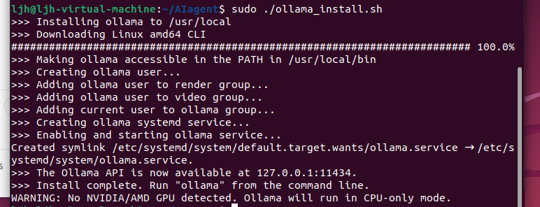

# 基于 ollama 私有化大模型

# 建议：在虚拟机上操作

# ollama

ollama 是一个将许多大模型管理起来，可以进行下载的，类似于 docker 镜像的平台。

网站： [https://ollama.com/](https://ollama.com/)


## 安装

### ollama 平台下载

点击 download，并选择 Linux


下面会出现一个下载指令，在虚拟机上打开终端输入指令

```Plain Text
curl -fsSL https://ollama.com/install.sh | sh
```

如果显示没有`curl`，输入指令`sudo apt install curl`

然后在输入下载指令，等待下载完成。

**but!!!!!!!!! 你以为这就完了？？？？这个时候，你可能发现，根本下不下来。通过咨询发现，原来是 ollama3 之后，国内下载就非常的龟速。这个时候，我们要对.sh 文件进行操作。**

首先，在自己想要存放的文件夹里面打开终端。

输入指令

```Plain Text
# 下载安装脚本
curl -fsSL https://ollama.com/install.sh -o ollama_install.sh
# 给脚本添加执行权限
chmod +x ollama_install.sh
```

然后，打开`ollama_install.sh`文件

找到

- **https://ollama.com/download/ollama-linux-\${ARCH}\${VER\_PARAM}**
- **https://ollama.com/download/ollama-linux-amd64-rocm.tgz\${VER\_PARAM}**

这两个下载地址，然后分别改成

- **https://github.moeyy.xyz/https://github.com/ollama/ollama/releases/download/v0.3.2/ollama-linux-amd64**
- **https://github.moeyy.xyz/https://github.com/ollama/ollama/releases/download/v0.3.2/ollama-linux-amd64-rocm.tgz**

**注意！！！这里我们使用的是 GitHub 下载，记得打开梯子进行下载，如果不知道怎么在虚拟机上挂梯子，可以尝试使用\*\***桥接模式\***\*。**

最后，再次打开终端，输入运行`.sh`的指令

```Plain Text
sudo ./ollama_install.sh
```

**还有就是，在下载过程，可能会出现如下情况，不要慌，这是因为梯子不稳定，重新上述\*\***.sh\***\*运行指令就行。**


下载完成



### 大模型下载

（这里我们用千问举例子）


熟悉的界面不同的选择，则此我一定会拿回我的一切！！！！（咳咳，中二了）

点击上方的 Models

在搜索里面输入`qwen2`


点击进入后，先不要着急下载


看到这个东西，点击它


你会发现有很多不同的选择，如果是个人尝试的话，我建议下个最小的 0.5b 的就行，不然，你的虚拟机带不起来，30b 要求 30 个核（好像 maybe 忘记了）

点击 0.5b


在图片的左上角，复制下来，输入到终端执行

```Plain Text
ollama run qwen2:0.5b
```

等待下载


成功


**这里其实就已经可以使用了。**

### 下载 OpenWebUI

[OpenWebUI](https://openwebui.com/)是一个可扩展、功能丰富且用户友好的自托管 WebUI，它支持完全离线操作，并 兼容 Ollama 和 OpenAI 的 API。这为用户提供了一个可视化的界面，使得与大型语言模型的交互 更加直观和便捷。

#### 安装 OpenWebUI

在已经下载的虚拟机上输入指令

```Plain Text
docker run -d -p 3000:8080 --add-host=host.docker.internal:host-gateway -v open
-webui:/app/backend/data --name open-webui --restart always ghcr.io/open-webui/
open-webui:main
```

没有`docker`的输入下载`docker`的指令

##### 安装 docker

你需要先安装 Docker 才能运行 Docker 容器。你可以使用以下命令来安装 Docker：

```Plain Text
sudo apt update
sudo apt install docker.io
```

安装完成后，启动 Docker 服务：

```Plain Text
sudo systemctl start docker
sudo systemctl enable docker
```

安装完成后，你可以使用以下命令检查 Docker 是否正常安装：

```Plain Text
docker --version
```

如果返回 Docker 的版本信息，说明安装成功。

##### 运行刚刚的指令

```Plain Text
docker run -d -p 3000:8080 --add-host=host.docker.internal:host-gateway -v open-webui:/app/backend/data --name open-webui --restart always ghcr.io/open-webui/open-webui:main
```

然后等待下载完成


等了两天终于成功了，主要是网络下的太慢了，第一天超时了第二天下了一天才下完


然后，你可以输入指令进行查看当前运行的容器（open-webui）

```Plain Text
docker ps
```

如果显示`permission ...` 应该是没有权限，加上`sudo`就行

```Plain Text
sudo docker ps
```


可以看到正在运行中

如此，你就可以打开本地的浏览器，输入网站进行访问了，直接输入就行

```Plain Text
http://localhost:3000
```

登录的时候需要注册，随便填就行，然后进入界面


**ok！第二个下载完成！！！！**

### 结合 ollama 和 OpenWebUI

#### 配置环境变量

1. 打开并编辑服务文件

```Plain Text
sudo vim /etc/systemd/system/ollama.service
```

2. 先点击任意键，进入 insert 模式，添加环境变量

```Plain Text
[Service]
ExecStart=/usr/local/bin/ollama serve
User=ollama
Group=ollama
Restart=always
RestartSec=3
Environment="PATH=/usr/local/sbin:/usr/local/bin:/usr/sbin:/usr/bin:/sbin:/bin"
Environment="OLLAMA_HOST=0.0.0.0:11434"
Environment="OLLAMA_ORIGINS=*"
```

把下面两条变量添加进去就行

- Environment="OLLAMA_HOST=0.0.0.0:11434"
- Environment="OLLAMA_ORIGINS=\*"


3. 保存并退出`vim`

在`vim`中，执行以下步骤保存并退出：

- 按 `Esc` 键确保您处于命令模式。
- 输入 `:wq` 然后按 `Enter` 保存文件并退出。

4. 重新加载`systemd` 并重启服务

```Plain Text
sudo systemctl daemon-reload
sudo systemctl restart ollama.service
```

#### 重启 docker 容器

```Plain Text
sudo docker restart open-webui
```

想要查看当前你的 docker 中的所有容器的话，输入指令

```Plain Text
sudo docker ps -a
```

#### 启动 ollama 模型

其实这里的 ollama 模型也就是我们刚刚之前下载的 qwen2 模型，就是后端

下载的 OpenWebUI，就是前端

想要前端可以发挥功能，就应该要启动后端

如果如下界面你关闭了


重新执行指令（不会重新下载，会直接启动）

```Plain Text
ollama run qwen2:0.5b
```

然后，打开网页，输入网址

```Plain Text
http://localhost:3000
```


点击`Select a model` ，点击你下载的模型就好了


然后你就可以快乐的使用自己私有化的 AI 了！！！！


这里我再附上另一个可以在 OpenWebUI 上使用功能的方法


我负责帮你找到下载的地方，其他的操作看：

[适配 Ollama 的前端界面 Open WebUI](https://blog.csdn.net/wbsu2004/article/details/136443260)

# OK！完结！！！\*★,°\*:.☆(￣ ▽ ￣)/\$:\*.°★\* 。
